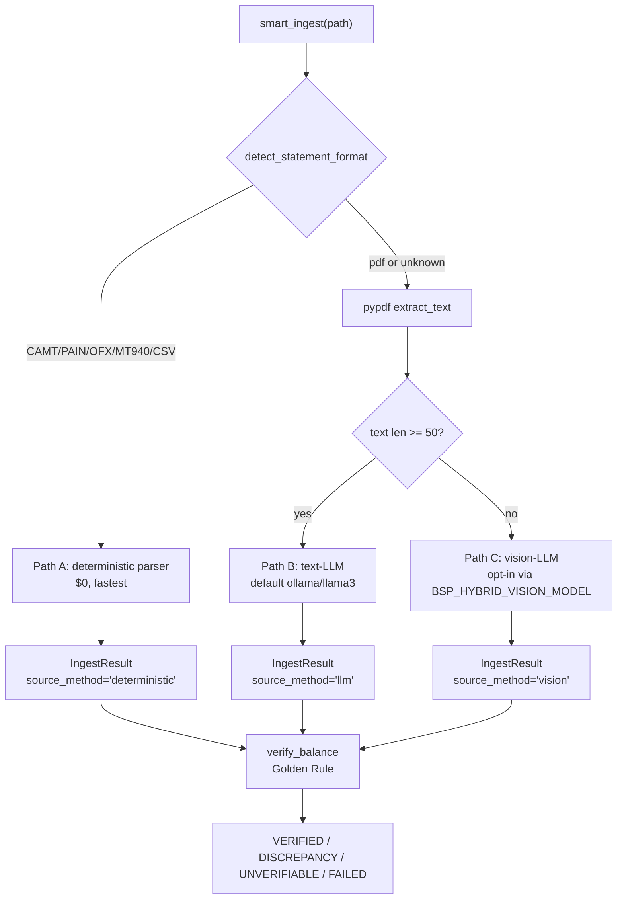

<!-- SPDX-License-Identifier: Apache-2.0 -->

<h1 align="center">Bank Statement Parser</h1>

<p align="center">
  Bank statement parsing for Python — six structured formats and
  PDFs, digital or scanned, into one auditable
  <code>Transaction</code> model.
</p>

<p align="center">
  <a href="https://github.com/sebastienrousseau/bankstatementparser/actions"></a>
  <a href="https://pypi.org/project/bankstatementparser/"></a>
  <a href="https://pypi.org/project/bankstatementparser/"></a>
  <a href="https://codecov.io/github/sebastienrousseau/bankstatementparser?branch=main"></a>
  <a href="LICENSE"></a>
</p>

---

Parse bank statements across **six structured formats** (CAMT,
PAIN.001, CSV, OFX/QFX, MT940) **and PDFs** — both digital and
scanned — into a single unified `Transaction` model. ISO 20022
files take the deterministic path; PDFs fall through to a
configurable LLM (Ollama by default, any LiteLLM-supported
provider) and finally to a multimodal vision model for
scanned/photocopied statements.

Built for finance teams, treasury analysts, and fintech developers
who need reliable, auditable extraction across the full spectrum
of bank statement formats — without sending data to external
services unless they explicitly opt in.

---

## Contents

**Getting started**

- [Install](#install) — pip extras, requirements, local development
- [Quick Start](#quick-start) — parse a statement in three lines

**The pipeline**

- [How it works](#how-it-works) — routing diagram: deterministic first, LLM and vision as opt-in fallbacks
- [Key Features](#key-features) — parsing, hybrid PDF pipeline, verification, enrichment, security

**Library reference**

- [PII Redaction](#pii-redaction) — masked by default, opt in to see full data
- [Streaming](#streaming) — bounded memory at 50,000 transactions
- [Performance](#performance) — throughput and latency, CI-enforced
- [Parallel Parsing](#parallel-parsing) — multi-file batches across CPU cores
- [Command Line](#command-line) — console script and REST API
- [Deduplication](#deduplication) — exact hashes + suspected matches
- [Export](#export) — CSV, JSON, Excel, Polars, hledger, beancount
- [Examples](#examples) — 23 runnable scripts (14 deterministic + 9 hybrid)
- [XML Tag Mapping](#xml-tag-mapping) — ISO 20022 tags to DataFrame columns
- [Ecosystem](#ecosystem) — companion packages (MCP, LSP, writers, loaders)

**Operational**

- [Project Layout](#project-layout)
- [Security](#security) — XXE, ZIP-bomb, and path-traversal protection
- [Verify the Repository](#verify-the-repository) — the five local gates
- [Versioning](#versioning) — SemVer policy for the 0.y.z series
- [Contributing](#contributing)
- [FAQ](#faq)
- [Documentation](#documentation) — all reference docs
- [License](#license)

---

## Install

```bash
# Core install — deterministic parsers only (CAMT, PAIN.001, CSV, OFX, QFX, MT940)
pip install bankstatementparser

# Add Excel (.xlsx) export support (openpyxl)
pip install 'bankstatementparser[excel]'

# Add the text-LLM path for digital PDFs (litellm + pypdf)
pip install 'bankstatementparser[hybrid]'

# Add higher-fidelity table extraction (adds pdfplumber)
pip install 'bankstatementparser[hybrid-plus]'

# Add the multimodal vision path for scanned/photocopied PDFs (adds pypdfium2)
pip install 'bankstatementparser[hybrid-vision]'

# Add LLM-powered transaction categorization
pip install 'bankstatementparser[enrichment]'

# Add the REST API microservice (FastAPI + uvicorn)
pip install 'bankstatementparser[api]'
```

The core install has zero AI dependencies. Every extra is opt-in
and pure-Python — no `poppler`, no system libraries, no GPU
required.

### Requirements

- Python **3.10** through **3.14** (Python 3.9 was dropped in
  v0.0.6 — pin to v0.0.5 if you cannot upgrade your interpreter).
- Poetry (for local development).

> **Python version note.** The deterministic core (CAMT, PAIN.001,
> CSV, OFX, QFX, MT940) supports Python **3.10–3.14**. The optional
> `[hybrid]`, `[hybrid-plus]`, `[hybrid-vision]`, and
> `[enrichment]` extras pull in `litellm`, which currently requires
> **Python <3.14** upstream — on Python 3.14 the LLM extras will
> not install. Pin `Python 3.13` for the full hybrid pipeline;
> upgrade to 3.14 freely if you only need deterministic parsing.

### Local development

Clone and install on **macOS, Linux, or WSL**:

```bash
git clone https://github.com/sebastienrousseau/bankstatementparser.git
cd bankstatementparser
python3 -m venv .venv
source .venv/bin/activate
pip install poetry
poetry install --with dev -E excel
make install-hooks   # pre-commit hook runs `make verify` before every commit
```

---

## Quick Start

### Parse a CAMT statement

```python
from bankstatementparser import CamtParser

parser = CamtParser("statement.xml")
transactions = parser.parse()
print(transactions)
```

```text
   Amount Currency DrCr  Debtor Creditor      ValDt      AccountId
 105678.5      SEK CRDT MUELLER          2010-10-18 50000000054910
-200000.0      SEK DBIT                  2010-10-18 50000000054910
  30000.0      SEK CRDT                  2010-10-18 50000000054910
```

### Parse a PAIN.001 payment file

```python
from bankstatementparser import Pain001Parser

parser = Pain001Parser("payment.xml")
payments = parser.parse()
print(payments)
```

```text
  PmtInfId PmtMtd  InstdAmt Currency  CdtrNm         EndToEndId
  PMT-001  TRF     1500.00  EUR       ACME Corp      E2E-001
  PMT-001  TRF     2300.50  EUR       Global Ltd     E2E-002
```

### Auto-detect the format

```python
from bankstatementparser import create_parser, detect_statement_format

fmt = detect_statement_format("transactions.ofx")
parser = create_parser("transactions.ofx", fmt)
records = parser.parse()
```

Works with `.xml`, `.csv`, `.ofx`, `.qfx`, and `.mt940` files.

### Hybrid extraction (PDFs included) *(v0.0.5)*

`smart_ingest()` is the single entry point that routes any file
through the cheapest viable extraction path:

```python
from bankstatementparser.hybrid import smart_ingest

# Path A — deterministic parser (free, fastest, $0)
result = smart_ingest("statement.xml")
print(result.source_method)         # "deterministic"

# Path B — text-LLM for digital PDFs (set BSP_HYBRID_MODEL=ollama/llama3)
result = smart_ingest("statement.pdf")
print(result.source_method)         # "llm"
print(result.verification.status)   # VERIFIED | DISCREPANCY | UNVERIFIABLE | FAILED

# Path C — multimodal vision for scanned PDFs (set BSP_HYBRID_VISION_MODEL)
# auto-routed when pypdf cannot extract enough text
result = smart_ingest("scan.pdf")
print(result.source_method)         # "vision"
```

Every row carries:

- `source_method` — `"deterministic"`, `"llm"`, or `"vision"` for
  full audit provenance
- `transaction_hash` — MD5 fingerprint of
  `date | normalized_description | amount`, ready for idempotent
  re-ingestion
- `confidence` — float between 0 and 1 for LLM rows, `None` for
  deterministic
- `raw_source_text` — best-effort source-text slice for the v0.0.6
  review-mode UI

A complete walkthrough with synthetic UK-bank PDFs, mock vs. live
mode, and a Mermaid flow diagram lives in
[`examples/hybrid/README.md`](examples/hybrid/README.md).

### Parse from memory (no disk I/O)

```python
from bankstatementparser import CamtParser

xml_bytes = download_from_sftp()  # your own function
parser = CamtParser.from_bytes(xml_bytes, source_name="daily.xml")
transactions = parser.parse()
```

Pass only decompressed XML to `from_string()` or `from_bytes()`.
For ZIP archives, use `iter_secure_xml_entries()`.

### Parse XML files inside a ZIP archive

```python
from bankstatementparser import CamtParser, iter_secure_xml_entries

for entry in iter_secure_xml_entries("statements.zip"):
    parser = CamtParser.from_bytes(entry.xml_bytes, source_name=entry.source_name)
    transactions = parser.parse()
    print(entry.source_name, len(transactions), "transactions")
```

The iterator enforces size limits, blocks encrypted entries, and
rejects suspicious compression ratios before any XML parsing
occurs.

---

## How it works

`smart_ingest()` routes any input file through the cheapest viable
extraction path. Deterministic parsers always run first ($0 cost).
Text and vision LLMs are fallbacks for unstandardized PDFs — both
are opt-in via separate install extras and can be swapped between
any LiteLLM-supported provider (Ollama, Anthropic, OpenAI,
Gemini, …).



Every extracted row carries an immutable `transaction_hash`, an
audit-trail `source_method` tag, and (for LLM rows) a `confidence`
score — see
[Hybrid extraction](#hybrid-extraction-pdfs-included-v005) above
for the full surface.

---

## Key Features

### Parsing

| Feature | Description |
|---|---|
| **6 structured formats** | CAMT.053, PAIN.001, CSV, OFX, QFX, MT940 |
| **Auto-detection** | `detect_statement_format()` identifies the format; `create_parser()` returns the right parser |
| **Streaming** | `parse_streaming()` at 27,000+ tx/s (CAMT) and 52,000+ tx/s (PAIN.001) with bounded memory |
| **Parallel** | `parse_files_parallel()` for multi-file batch processing across CPU cores |
| **In-memory parsing** | `from_string()` and `from_bytes()` parse XML without touching disk |

### Hybrid PDF pipeline (LLM-assisted)

| Feature | Description |
|---|---|
| **Hybrid PDF pipeline** *(v0.0.5)* | `smart_ingest()` routes digital PDFs through a text-LLM and scanned PDFs through a multimodal vision model. Deterministic parsers always tried first ($0 cost). |
| **Local-first LLM** *(v0.0.5)* | Ollama is the default backend; switch to Anthropic, OpenAI, or any LiteLLM provider via `BSP_HYBRID_MODEL`. Vision is opt-in via `BSP_HYBRID_VISION_MODEL` — no surprise downloads. |
| **Direct Ollama bridge** *(v0.0.7)* | Auto-bypasses the upstream LiteLLM ↔ Ollama hang on long vision prompts. `ollama/minicpm-v` recommended over `ollama/llava` for document OCR. |
| **Strip mode** *(v0.0.7)* | `VisionExtractor(strip_rows=True)` splits dense pages into overlapping bands for small local models — fixes sign-flip errors and improves accuracy on 15+ row statements. |
| **Bounding boxes** *(v0.0.6)* | `Transaction.source_bbox` carries per-row normalized coordinates from the vision path for downstream review UIs. |
| **Bulk directory scanner** *(v0.0.8)* | `scan_and_ingest(directory, pattern="**/*.pdf")` scans a folder tree, runs `smart_ingest` on every match, deduplicates across the entire batch. |

### Data quality & verification

| Feature | Description |
|---|---|
| **Golden Rule verification** *(v0.0.5)* | Every result carries `opening + credits − debits == closing` status: `VERIFIED`, `DISCREPANCY`, `UNVERIFIABLE`, or `FAILED`. |
| **Multi-currency verification** *(v0.0.8)* | `verify_balance_multi_currency()` groups transactions by currency and runs the Golden Rule independently per group — no more false `DISCREPANCY` on multi-currency statements. |
| **Idempotent dedup** *(v0.0.5)* | Every `Transaction` carries a stable `transaction_hash` (MD5 of date + normalized description + amount). `Deduplicator.dedupe_by_hash()` makes incremental ingestion safe to re-run. |
| **Interactive review** *(v0.0.6)* | `--type review` CLI walks through discrepancies with accept/edit/skip/delete/quit. `IngestResult.to_json()` / `.from_json()` for stable round-trip with embedded audit trail. |

### Enrichment & export

| Feature | Description |
|---|---|
| **Categorization** *(v0.0.6)* | `bankstatementparser.enrichment.Categorizer` tags transactions with a pluggable category schema (Plaid 13-category default) and an optional `is_business_expense` flag. Wrapper model — never mutates the original `Transaction`. |
| **Account mapping** *(v0.0.8)* | `AccountMapper` with ordered regex rules loaded from JSON config. First match wins. Pairs with the ledger exporter for end-to-end plaintext-accounting workflows. |
| **hledger + beancount export** *(v0.0.8)* | `to_hledger()` and `to_beancount()` produce journal strings for plaintext-accounting workflows. Uses `Transaction.category` as the contra-account when set. |
| **Export** | CSV, JSON, Excel (`.xlsx`), and optional Polars DataFrames |
| **REST API** *(v0.0.8)* | FastAPI microservice: `POST /ingest` a file, get JSON back. `GET /health` for monitoring. `pip install 'bankstatementparser[api]'`. |

### Security & quality

| Feature | Description |
|---|---|
| **PII redaction** | Names, IBANs, and addresses masked by default — opt in with `--show-pii` |
| **Secure ZIP** | `iter_secure_xml_entries()` rejects zip bombs, encrypted entries, and suspicious compression ratios |
| **Tested** | 844 tests, coverage gated at 100% in CI, property-based fuzzing with Hypothesis |

---

## PII Redaction

PII (names, IBANs, addresses) is **redacted by default** in
console output and streaming mode.

```python
# Redacted by default
for tx in parser.parse_streaming(redact_pii=True):
    print(tx)  # Names and addresses show as ***REDACTED***

# Opt in to see full data
for tx in parser.parse_streaming(redact_pii=False):
    print(tx)
```

File exports (CSV, JSON, Excel) always contain the full unredacted
data.

---

## Streaming

Process large files incrementally. Memory stays bounded regardless
of file size — tested at 50,000 transactions with sub-2x memory
scaling.

```python
from bankstatementparser import CamtParser

parser = CamtParser("large_statement.xml")
for transaction in parser.parse_streaming():
    process(transaction)  # each transaction is a dict
```

Works with both `CamtParser` and `Pain001Parser`. PAIN.001 files
over 50 MB use chunk-based namespace stripping via a temporary
file — the full document is never loaded into memory.

---

## Performance

| Metric | CAMT | PAIN.001 |
|---|---|---|
| **Throughput** | 27,000+ tx/s | 52,000+ tx/s |
| **Per-transaction latency** | 37 us | 19 us |
| **Time to first result** | < 1 ms | < 2 ms |
| **Memory scaling** | Constant (1K–50K) | Constant (1K–50K) |

Performance is flat from 1,000 to 50,000 transactions. CI enforces
minimum TPS and latency thresholds, and a non-blocking benchmark
job compares every run against the last known-good `main`
baseline.

---

## Parallel Parsing

Process multiple files simultaneously across CPU cores:

```python
from bankstatementparser import parse_files_parallel

results = parse_files_parallel([
    "statements/jan.xml",
    "statements/feb.xml",
    "statements/mar.xml",
])

for r in results:
    print(r.path, r.status, len(r.transactions), "rows")
```

Uses `ProcessPoolExecutor` to bypass the GIL. Each file is parsed
in its own worker process. Auto-detects format per file, or force
with `format_name="camt"`.

---

## Command Line

After installation a `bankstatementparser` console script is
available on `PATH`:

```bash
# Parse and display
bankstatementparser --type camt --input statement.xml

# Export to CSV
bankstatementparser --type camt --input statement.xml --output transactions.csv

# Stream with PII visible
bankstatementparser --type camt --input statement.xml --streaming --show-pii

# v0.0.5 — hybrid pipeline (auto-routes deterministic / text-LLM / vision)
bankstatementparser --type ingest --input statement.pdf
bankstatementparser --type ingest --input statement.pdf --output ledger.csv

# v0.0.6 — interactive review of saved IngestResult JSON
bankstatementparser --type review --input result.json
bankstatementparser --type review --input result.json --output reviewed.json

# v0.0.9 — also review rows the LLM was unsure about (confidence < 0.8)
bankstatementparser --type review --input result.json --review-below 0.8
```

Supports `--type camt`, `--type pain001`, `--type ingest`
(v0.0.5), and `--type review` (v0.0.6). The
`python -m bankstatementparser.cli ...` invocation form continues
to work for parity with older releases.

### REST API *(v0.0.8)*

```bash
pip install 'bankstatementparser[api]'
bankstatementparser-api --port 8000

# POST a file, get JSON back
curl -F file=@statement.pdf http://localhost:8000/ingest

# Health check
curl http://localhost:8000/health
```

Default bind is `127.0.0.1` (localhost-only). Use
`--host 0.0.0.0` for container deployments.

#### Security defaults

- Uploads are streamed in chunks; the request is rejected with
  **413 Payload Too Large** once the cumulative size exceeds
  `BSP_API_MAX_UPLOAD_BYTES` (default **25 MB**).
- The uploaded filename is reduced to its basename —
  caller-supplied path components are dropped — and the suffix
  must match one of the allowed input extensions (`.xml`, `.csv`,
  `.ofx`, `.qfx`, `.mt940`, `.sta`, `.pdf`, `.json`). Anything
  else returns **400 Bad Request**.
- On parse failure the response carries a UUID `correlation_id`;
  the raw exception is logged server-side only. Status
  **422 Unprocessable Entity**.
- **Authentication, authorization, and rate limiting are out of
  scope** for this microservice — wire them in your reverse proxy
  (nginx `auth_basic` + `limit_req`, a WAF, or an API gateway).
  The default `127.0.0.1` bind means a fresh
  `bankstatementparser-api` is never publicly reachable unless you
  explicitly opt in via `--host 0.0.0.0`.

---

## Deduplication

Detect duplicate transactions across multiple sources:

```python
from bankstatementparser import CamtParser, Deduplicator

parser = CamtParser("statement.xml")
dedup = Deduplicator()
result = dedup.deduplicate(dedup.from_dataframe(parser.parse()))

print(f"Unique: {len(result.unique_transactions)}")
print(f"Exact duplicates: {len(result.exact_duplicates)}")
print(f"Suspected matches: {len(result.suspected_matches)}")
```

The `Deduplicator` uses deterministic hashing for exact matches
and configurable similarity thresholds for suspected matches. Each
match group includes a confidence score and reason for
auditability.

---

## Export

```python
parser = CamtParser("statement.xml")
parser.parse()

# CSV
parser.export_csv("output.csv")

# JSON (includes summary + transactions)
parser.export_json("output.json")

# Excel
parser.camt_to_excel("output.xlsx")
```

### Polars (optional)

Convert any parser output to a Polars DataFrame:

```python
polars_df = parser.to_polars()
lazy_df = parser.to_polars_lazy()
```

Install with `pip install bankstatementparser[polars]`.

### hledger + beancount *(v0.0.8)*

Export transactions to plaintext-accounting journal formats:

```python
from bankstatementparser.export import to_hledger, to_beancount

journal = to_hledger(transactions, account="Assets:Bank:Checking")
Path("journal.ledger").write_text(journal)

# Or beancount format:
journal = to_beancount(transactions, account="Assets:Bank:Checking")
```

Uses `Transaction.category` as the contra-account when set by the
enrichment module.

### Bulk directory scanner *(v0.0.8)*

Scan a folder tree and ingest every statement, deduplicating
across the batch:

```python
from bankstatementparser.hybrid import scan_and_ingest

batch = scan_and_ingest("statements/2026/", pattern="**/*.pdf")
print(f"{batch.file_count} files, {batch.total_unique} unique transactions")
```

### Account mapping *(v0.0.8)*

Map transactions to ledger accounts via configurable regex rules:

```python
from bankstatementparser.enrichment import AccountMapper

mapper = AccountMapper.from_json("mapping.json")
for tx, account in zip(transactions, mapper.map_batch(transactions)):
    print(f"{tx.description} -> {account}")
```

### Multi-currency verification *(v0.0.8)*

```python
from bankstatementparser.hybrid import verify_balance_multi_currency

results = verify_balance_multi_currency(
    transactions,
    balances={"GBP": (opening, closing), "EUR": (opening, closing)},
)
for currency, v in results.items():
    print(f"{currency}: {v.status.value}")
```

---

## Examples

See [`examples/`](examples/README.md) for 23 runnable scripts
(14 deterministic + 9 hybrid):

### Deterministic parsers

| Example | What it demonstrates |
|---|---|
| `parse_camt_basic.py` | Load a CAMT.053 file and print transactions |
| `parse_camt_from_string.py` | Parse CAMT from an in-memory XML string |
| `inspect_camt.py` | Extract balances, stats, and summaries |
| `export_camt.py` | Export to CSV and JSON |
| `export_camt_excel.py` | Export to Excel workbook |
| `stream_camt.py` | Stream transactions incrementally |
| `parse_camt_zip.py` | Secure ZIP archive processing |
| `parse_detected_formats.py` | Auto-detect CSV, OFX, MT940, and XML formats |
| `parse_pain001_basic.py` | Parse a PAIN.001 payment file |
| `export_pain001.py` | Export PAIN.001 to CSV and JSON |
| `stream_pain001.py` | Stream payments incrementally |
| `validate_input.py` | Validate file paths with InputValidator |
| `compatibility_wrappers.py` | Legacy API wrappers |
| `cli_examples.sh` | CLI commands for CAMT and PAIN.001 |

### Hybrid pipeline *(v0.0.5)*

| Example | What it demonstrates |
|---|---|
| `hybrid/generate_sample_pdfs.py` | Produce reproducible synthetic UK-bank PDFs (digital + scanned) |
| `hybrid/01_smart_ingest_deterministic.py` | Path A — `smart_ingest()` against a CAMT.053 fixture, $0 cost |
| `hybrid/02_smart_ingest_text_llm.py` | Path B — text-LLM extraction from a digital PDF (mock or live Ollama) |
| `hybrid/03_smart_ingest_vision.py` | Path C — multimodal vision extraction with `LOW_TEXT_DENSITY` auto-routing |
| `hybrid/04_golden_rule.py` | `verify_balance()`, `verify_transactions()`, and `verify_continuity()` across `VERIFIED` / `DISCREPANCY` / `UNVERIFIABLE` outcomes |
| `hybrid/05_dedupe_recurring.py` | `normalize_description()` + `dedupe_by_hash()` for idempotent batching |
| `hybrid/06_cli_walkthrough.sh` | Four flavours of the new `--type ingest` CLI subcommand |
| `hybrid/06_cli_walkthrough.ps1` | PowerShell sibling of the bash walkthrough (native Windows) |
| `hybrid/07_scan_and_ingest.py` | Bulk directory ingest with `scan_and_ingest()` — cross-file dedup + continuity check |

See [`examples/hybrid/README.md`](examples/hybrid/README.md) for
the full walkthrough including a Mermaid flow diagram, the
cross-platform verification matrix, and the Ollama smoke-test
results.

---

## XML Tag Mapping

See [`docs/MAPPING.md`](docs/MAPPING.md) for a complete reference
of ISO 20022 XML tags to DataFrame columns across all six formats.
Use this when integrating with ERP systems or building
reconciliation pipelines.

---

## Ecosystem

`bankstatementparser` is the core engine. Optional, independently
versioned companion packages build on it — each is its own repository
and Python package, so you install only what you need and the core
stays dependency-light.

| Package | PyPI | Role | What it adds |
|---|---|---|---|
| [`bankstatementparser-mcp`](https://github.com/sebastienrousseau/bankstatementparser-mcp) | [](https://pypi.org/project/bankstatementparser-mcp/) | AI agents | [Model Context Protocol](https://modelcontextprotocol.io) server — exposes detect / parse / validate / summarize as tools for Claude Desktop and other LLM clients |
| [`bankstatementparser-lsp`](https://github.com/sebastienrousseau/bankstatementparser-lsp) | [](https://pypi.org/project/bankstatementparser-lsp/) | Editors | Language Server with live MT940 diagnostics (missing tags, malformed balance / `:61:` lines) over [pygls](https://github.com/openlawlibrary/pygls) |
| [`bankstatementparser-writer-xlsx`](https://github.com/sebastienrousseau/bankstatementparser-writer-xlsx) | [](https://pypi.org/project/bankstatementparser-writer-xlsx/) | Output | Write parsed transactions (DataFrame, `Transaction` list, or dicts) to a polished Excel `.xlsx` workbook |
| [`bankstatementparser-loader-mt942`](https://github.com/sebastienrousseau/bankstatementparser-loader-mt942) | [](https://pypi.org/project/bankstatementparser-loader-mt942/) | Input | Parse SWIFT **MT942** interim transaction reports into `Transaction` objects (a format the core does not read) |
| [`bankstatementparser-loader-bai2`](https://github.com/sebastienrousseau/bankstatementparser-loader-bai2) | [](https://pypi.org/project/bankstatementparser-loader-bai2/) | Input | Parse **BAI2** cash-management files into `Transaction` objects (a format the core does not read) |

Loaders turn an additional source format into the same unified
`Transaction` model; writers take parsed data back out to another
target. Each companion pins `bankstatementparser` as a dependency and
ships its own 100%-coverage test suite.

```bash
# Mix and match: e.g. read an MT942 file, then export to Excel
pip install bankstatementparser-loader-mt942 bankstatementparser-writer-xlsx
```

Loaders hand back the same `Transaction` model the core parsers
produce, so `load_mt942_file(...)` then `write_xlsx(...)` composes
cleanly — see each companion's README for runnable examples.

---

## Project Layout

```text
bankstatementparser/            Source code (32 modules)
bankstatementparser/hybrid/     PDF pipeline: orchestrator, llm_extractor, vision, scanner, ollama_direct, verification
bankstatementparser/enrichment/ Categorizer, AccountMapper, EnrichedTransaction
bankstatementparser/export/     hledger + beancount journal export
bankstatementparser/api.py      REST API microservice (FastAPI)
docs/compliance/                ISO 13485 validation, risk register, traceability matrix
examples/                       14 deterministic + 9 hybrid runnable example scripts
scripts/                        SBOM generation, checksums, signature verification
tests/                          844 tests (unit, integration, property-based, security, hybrid mocks)
```

---

## Security

Bank statement files contain sensitive financial and personal
data. This library is designed with security as a primary
constraint:

- **XXE protection** — `resolve_entities=False`,
  `no_network=True`, `load_dtd=False`
- **ZIP bomb protection** — compression ratio limits, entry size
  caps, encrypted entry rejection
- **Path traversal prevention** — dangerous pattern blocklist,
  symlink resolution
- **PII redaction** — default masking of names, IBANs, and
  addresses
- **Signed commits** — enforced in CI via GitHub API verification
- **Supply chain** — SHA-256 hash-locked dependencies, CycloneDX
  SBOM, build provenance attestation

For vulnerability reports, see [SECURITY.md](.github/SECURITY.md).

For the full compliance suite, see
[`docs/compliance/`](docs/compliance/).

---

## Verify the Repository

Run the full validation suite locally:

```bash
ruff check bankstatementparser tests examples scripts
ruff format --check bankstatementparser tests examples scripts
python -m mypy bankstatementparser
python -m pytest
bandit -r bankstatementparser examples scripts -q
```

---

## Versioning

This project follows [Semantic Versioning](https://semver.org).
While the version is `0.y.z`, any release may contain breaking
changes; they are always listed under a **Changed — BREAKING**
heading in the [CHANGELOG](CHANGELOG.md) with migration notes.
From `1.0.0`, breaking changes will require a major release.
Deprecations emit `DeprecationWarning` for at least one minor
release before removal.

---

## Contributing

Signed commits required. See [CONTRIBUTING.md](CONTRIBUTING.md).

---

## FAQ

**What formats are supported?**
CAMT.053, PAIN.001, CSV, OFX, QFX, and MT940.

**Does any data leave my infrastructure?**
No. Zero network calls. XML parsers enforce `no_network=True`. No
cloud, no telemetry.

**Is PII redacted automatically?**
Yes. Names, IBANs, and addresses are masked by default in console
output and streaming. File exports retain full data.

**Is the extraction deterministic?**
Yes. Same input produces byte-identical output. Critical for
financial auditing.

**Can it handle large files?**
Yes. `parse_streaming()` is tested at 50,000 transactions (~25 MB)
with bounded memory. Files over 50 MB use chunk-based streaming.

See [FAQ.md](FAQ.md) for the complete FAQ covering data privacy,
technical specs, and treasury workflows.

---

## Documentation

| Document | Covers |
|---|---|
| [API reference](https://sebastienrousseau.github.io/bankstatementparser/) | Full API reference generated from docstrings (mkdocs + mkdocstrings). Build locally with `poetry install --with docs && poetry run mkdocs serve`. |
| [`docs/MAPPING.md`](docs/MAPPING.md) | ISO 20022 XML tag to DataFrame column mapping for all six formats. |
| [`FAQ.md`](FAQ.md) | Data privacy, determinism, technical specs, treasury workflows. |
| [`CONTRIBUTING.md`](CONTRIBUTING.md) | Signed-commit policy, the five local gates, PR guidelines. |
| [`CHANGELOG.md`](CHANGELOG.md) | Per-release notes following Keep a Changelog. |
| [`SECURITY.md`](.github/SECURITY.md) | Disclosure policy, supported versions, contact. |
| [`docs/compliance/`](docs/compliance/) | ISO 13485 validation, risk register, traceability matrix. |
| [`examples/hybrid/README.md`](examples/hybrid/README.md) | Hybrid-pipeline walkthrough: mock vs. live mode, verification matrix, Ollama smoke tests. |

---

## License

Licensed under the
[Apache License 2.0](https://www.apache.org/licenses/LICENSE-2.0).
See [LICENSE](LICENSE).

See [CHANGELOG.md](CHANGELOG.md) for release history.

<p align="right"><a href="#contents">Back to Top</a></p>
