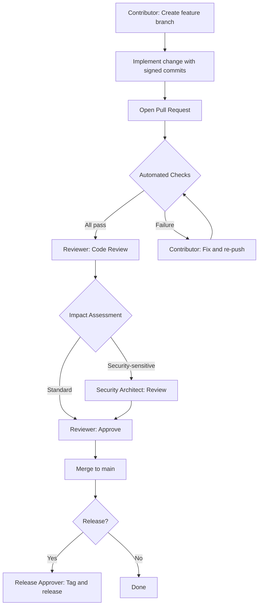

# Change Control Procedure

**Document ID:** BSP-CCP-001
**Revision:** 1.0
**Effective date:** 2026-03-31
**Owner:** Quality Architect

---

## Purpose

Defines the process for proposing, evaluating, approving, and implementing changes to `bankstatementparser`. Every change — source code, dependency, workflow, or documentation — follows this procedure.

---

## Scope

- Source code in `bankstatementparser/`
- Test code in `tests/`
- CI/CD workflows in `.github/workflows/`
- Dependencies in `pyproject.toml` and `poetry.lock`
- Compliance documents in `docs/compliance/`
- Scripts in `scripts/`

---

## Roles

| Role | Responsibility |
|---|---|
| **Contributor** | Proposes changes via signed commits on a feature branch |
| **Reviewer** | Evaluates code quality, security impact, and test coverage |
| **Release Approver** | Authorizes merge to `main` and release tag creation |
| **Security Architect** | Reviews changes to security-sensitive modules and dependencies |

---

## Change Request Workflow

---

## Impact Assessment

Evaluate every change against these criteria before approval:

| Category | Questions | Required Action |
|---|---|---|
| **Security** | Does this touch `input_validator.py`, `zip_security.py`, XML parsing, or PII handling? | Security Architect review |
| **Dependencies** | Does this add, remove, or update a dependency? | Vulnerability scan (pip-audit), SBOM refresh, SOUP Register update |
| **API** | Does this change public API signatures or behavior? | Update TRACEABILITY_MATRIX, examples, and version number |
| **Compliance** | Does this affect risk controls listed in the Risk Register? | Update Risk Register residual scores |
| **CI/CD** | Does this modify workflow files or action versions? | Verify SHA pinning, test on all platforms |

---

## Change Classification

| Class | Definition | Approval Required |
|---|---|---|
| **Critical** | Security fix, data integrity fix, vulnerability remediation | Reviewer + Security Architect |
| **Major** | New feature, dependency update, API change | Reviewer |
| **Minor** | Documentation, formatting, test additions | Reviewer |
| **Automated** | Dependabot PRs, scheduled scans | Reviewer (verify CI passes) |

---

## Automated Gates

Every Pull Request must pass these checks before merge:

1. **`commit-signature-verification`** — All commits signed
2. **`quality-gates / lint-and-typecheck`** — Ruff + mypy clean
3. **`quality-gates / unit-tests`** — coverage gate met (no regression vs. base), 0 failures
4. **`quality-gates / integration-tests`** — 0 failures
5. **`security / python-security`** — Bandit clean, pip-audit clean, hashes verified

---

## Rollback Procedure

If a merged change causes regression:

1. **Identify** the breaking commit via `git bisect`.
2. **Revert** with `git revert <sha>` (signed commit).
3. **Open PR** for the revert — follows standard automated gates.
4. **Update** the Risk Register if the regression exposed a new hazard.

---

## Review History

| Date | Revision | Changes |
|---|---|---|
| 2026-03-31 | 1.0 | Initial release. |
