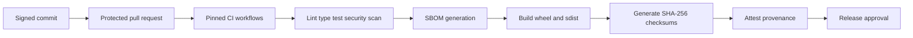

# Secure Path To Production

```mermaid
flowchart LR
  A[Signed commit] --> B[Protected pull request]
  B --> C[Pinned CI workflows]
  C --> D[Lint type test security scan]
  D --> E[SBOM generation]
  E --> F[Build wheel and sdist]
  F --> G[Generate SHA-256 checksums]
  G --> H[Attest provenance]
  H --> I[Release approval]
```
