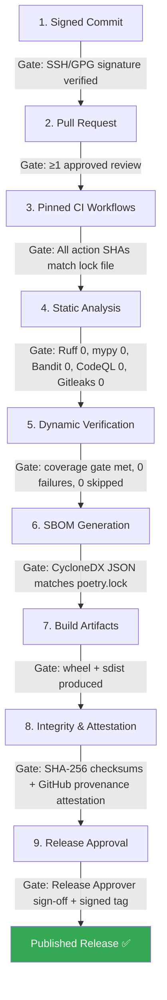

# Secure Path to Production

**Document ID:** BSP-SPP-001
**Revision:** 2.0
**Effective date:** 2026-03-31
**Owner:** Security Architect

---

## Pipeline Overview

Every release follows a nine-stage pipeline. Each stage has a defined gate criterion. No artifact advances without passing its gate.

---

## Stage Details

| # | Stage | Owner | Gate Criterion | Enforcement |
|---|---|---|---|---|
| 1 | **Signed Commit** | Contributor | Every commit signed with SSH or GPG key | `commit-signature-verification.yml` |
| 2 | **Pull Request** | Reviewer | At least one approved review; no dismissed reviews | GitHub branch protection |
| 3 | **Pinned CI Workflows** | CI | All GitHub Actions referenced by commit SHA, not tag | Manual audit + Dependabot |
| 4 | **Static Analysis** | CI | 0 errors from Ruff, mypy, Bandit, CodeQL, Gitleaks | `quality-gates.yml`, `security.yml` |
| 5 | **Dynamic Verification** | CI | Coverage gate met (no regression vs. base), 0 test failures, 0 skipped across Python 3.10–3.14 and 3 OS platforms | `quality-gates.yml` |
| 6 | **SBOM Generation** | CI | CycloneDX 1.5 JSON produced, component list matches `poetry.lock` | `scripts/generate_sbom.py` |
| 7 | **Build Artifacts** | CI | `poetry build` produces `.whl` and `.tar.gz` without error | `release-integrity.yml` |
| 8 | **Integrity & Attestation** | CI | SHA-256 checksums generated; GitHub build provenance attestation linked | `scripts/generate_checksums.py`, `attest-build-provenance` action |
| 9 | **Release Approval** | Release Approver | All stages 1–8 pass. Risk Register reviewed. Signed Git tag applied. | Manual gate |

---

## Approval Authority

| Action | Authority |
|---|---|
| Merge to `main` | Reviewer (after automated gates pass) |
| Create release tag (`v*`) | Release Approver |
| Override a failed gate | Not permitted without Risk Register update and Security Architect sign-off |

---

## Review History

| Date | Revision | Changes |
|---|---|---|
| 2026-03-31 | 2.0 | Added gate criteria per stage, approval authority, stage ownership, and enforcement mechanism detail. |
