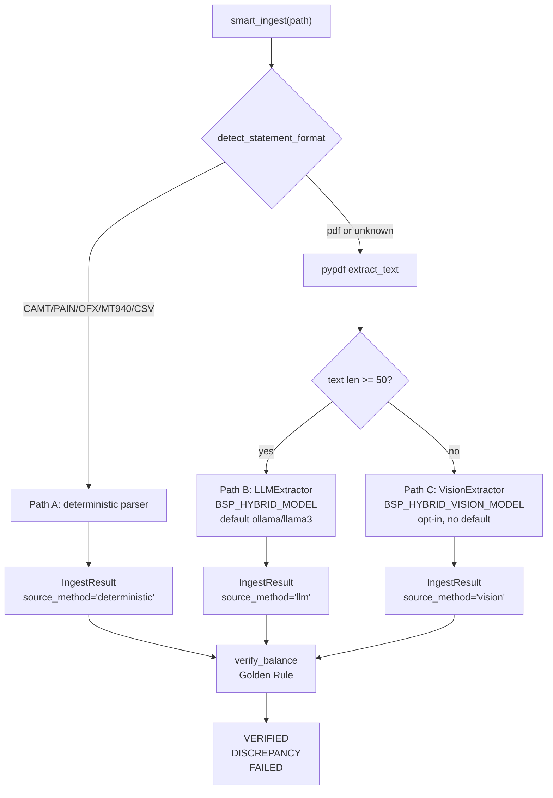

# Hybrid Pipeline Examples — v0.0.5 "Universal Extraction"

Runnable, end-to-end demonstrations of every code path the v0.0.5
hybrid pipeline can take. Every script works on **macOS, Linux, and
WSL** without any system-level dependencies — `pypdfium2`, `pypdf`,
and `litellm` are all pure-Python wheels.

## Why these examples are synthetic

Real bank PDFs cannot be redistributed (PII + copyright). Instead,
[`generate_sample_pdfs.py`](generate_sample_pdfs.py) creates two
reproducible files in `sample_data/`:

| File | Layer | Routes through |
|---|---|---|
| `digital.pdf` | Text + glyphs (born-digital) | Path B (text-LLM) |
| `scanned.pdf` | Pixels only (rasterised, no text layer) | Path C (vision-LLM) |

If you have a real statement you want to try, drop it into
`sample_data/` and change the `SAMPLE_PDF` constant at the top of
the relevant example. Every script is one path-variable away from
running on your own data.

## The three paths



## Prerequisites

| Mode | Install |
|---|---|
| Path A only (CAMT/PAIN/OFX/MT940/CSV) | `pip install bankstatementparser` |
| Path A + Path B (text-LLM for digital PDFs) | `pip install 'bankstatementparser[hybrid]'` |
| Plus higher-fidelity table extraction | `pip install 'bankstatementparser[hybrid-plus]'` |
| Plus vision (Path C, scans/photos) | `pip install 'bankstatementparser[hybrid-vision]'` |
| To regenerate the sample PDFs | `pip install reportlab pillow pypdfium2` |

For the **live** LLM examples, you also need either Ollama running
locally or an API key for a hosted provider:

```bash
# Local + private (recommended for finance data)
ollama serve &
ollama pull llama3      # text path
ollama pull minicpm-v   # vision path (v0.0.7+ recommended default)

export BSP_HYBRID_MODEL=ollama/llama3
export BSP_HYBRID_VISION_MODEL=ollama/minicpm-v
```

Or use any LiteLLM-supported provider:

```bash
export BSP_HYBRID_MODEL=anthropic/claude-3-haiku-20240307
export ANTHROPIC_API_KEY=sk-ant-...
```

> **WSL note** — if Ollama is running on Windows instead of inside
> WSL, point the library at the Windows host:
> `export BSP_HYBRID_API_BASE=http://host.docker.internal:11434`

## Quick start (15 minutes, end to end)

From the repository root:

```bash
# 1. install
pip install 'bankstatementparser[hybrid-vision]'
pip install reportlab pillow

# 2. generate the synthetic PDFs (one-off)
python examples/hybrid/generate_sample_pdfs.py

# 3. walk through the four paths
python examples/hybrid/01_smart_ingest_deterministic.py
python examples/hybrid/02_smart_ingest_text_llm.py     # mock mode
python examples/hybrid/03_smart_ingest_vision.py       # mock mode
python examples/hybrid/04_golden_rule.py
python examples/hybrid/05_dedupe_recurring.py
bash   examples/hybrid/06_cli_walkthrough.sh
python examples/hybrid/07_scan_and_ingest.py
```

The text-LLM and vision examples both default to **mock mode** so
they run end-to-end without any network calls. Set the env vars
above to switch to the live path.

## What each script teaches

| Script | Path | Live mode requires | Teaches |
|---|---|---|---|
| [`generate_sample_pdfs.py`](generate_sample_pdfs.py) | n/a | reportlab, pillow, pypdfium2 | How the two sample PDFs are produced. Tweak `TRANSACTIONS` to change the demo data. |
| [`01_smart_ingest_deterministic.py`](01_smart_ingest_deterministic.py) | A | nothing | `smart_ingest()` against a CAMT.053 fixture, `source_method='deterministic'`, `transaction_hash` per row, $0 cost |
| [`02_smart_ingest_text_llm.py`](02_smart_ingest_text_llm.py) | B | `BSP_HYBRID_MODEL` | Digital PDF → `pypdf` text → LiteLLM → `Transaction` rows. Mock mode shipped for offline runs. |
| [`03_smart_ingest_vision.py`](03_smart_ingest_vision.py) | C | `BSP_HYBRID_VISION_MODEL` | Scan → `pypdfium2` render → multimodal LLM → rows. Demonstrates `LOW_TEXT_DENSITY_THRESHOLD` automatic handover and a `DISCREPANCY` outcome. |
| [`04_golden_rule.py`](04_golden_rule.py) | n/a | nothing | `verify_balance()`, `verify_transactions()`, and `verify_continuity()` across the `VERIFIED`, `DISCREPANCY`, and `UNVERIFIABLE` outcomes on the same dataset. |
| [`05_dedupe_recurring.py`](05_dedupe_recurring.py) | n/a | nothing | `normalize_description()` noise stripping, `transaction_hash` stability, idempotent batching with `Deduplicator.dedupe_by_hash()`. |
| [`06_cli_walkthrough.sh`](06_cli_walkthrough.sh) | A/B/C | `BSP_HYBRID_*` env vars | Four flavours of the new `--type ingest` CLI subcommand (bash, for macOS / Linux / WSL). |
| [`06_cli_walkthrough.ps1`](06_cli_walkthrough.ps1) | A/B/C | `BSP_HYBRID_*` env vars | PowerShell sibling of the bash walkthrough — runs identically on native Windows (PowerShell 7+) without WSL. |
| [`07_scan_and_ingest.py`](07_scan_and_ingest.py) | A | nothing | `scan_and_ingest()` over a directory of statements: cross-file `transaction_hash` dedup, `ScanResult` summary, and the cross-statement `verify_continuity()` check. |

## Mock vs. live mode — what to expect

### Mock mode (default)

Both `02_*` and `03_*` ship with a small `_mock_completion()`
function that returns a fixed JSON payload matching the synthetic
sample. This is exactly the same shape a real LiteLLM response would
take, just deterministic. The orchestrator, `LLMExtractor`,
`VisionExtractor`, dedup, hashing, verification, and CLI all run
unchanged — only the network call is short-circuited.

Run with no env vars:

```text
$ python examples/hybrid/02_smart_ingest_text_llm.py
Mode: MOCK
Set BSP_HYBRID_MODEL=ollama/llama3 (and run `ollama serve`)
to call a real model instead of the mock.
...
  Source method:    llm
  Verification:     VERIFIED
```

### Live mode

Set the env var, make sure Ollama (or your provider) is reachable,
and re-run the same script. The output will look identical except
for the model latency and any small drift in description casing /
punctuation that the LLM produces.

```text
$ BSP_HYBRID_MODEL=ollama/llama3 python examples/hybrid/02_smart_ingest_text_llm.py
Mode: LIVE
Model: ollama/llama3
...
```

## Bringing your own real PDFs

Every example exposes a single path constant near the top:

```python
SAMPLE_PDF = EXAMPLE_DIR / "sample_data" / "digital.pdf"
```

Drop a real statement next to the script and change the constant —
the rest of the example runs unchanged. The CLI walkthrough takes
the path as a command-line argument so you don't even need to edit
anything:

```bash
bankstatementparser --type ingest --input /path/to/your_statement.pdf
```

## Cross-platform verification matrix

| Step | macOS | Linux | WSL | Native Windows |
|---|---|---|---|---|
| `pip install` of all extras | ✅ | ✅ | ✅ | ✅ |
| `generate_sample_pdfs.py` | ✅ | ✅ | ✅ | ✅ |
| `01_*` deterministic | ✅ | ✅ | ✅ | ✅ |
| `02_*` mock mode | ✅ | ✅ | ✅ | ✅ |
| `02_*` live mode (local Ollama) | ✅ | ✅ | ✅ * | ✅ |
| `03_*` mock mode | ✅ | ✅ | ✅ | ✅ |
| `03_*` live mode (Ollama llava) | ✅ | ✅ | ✅ * | ✅ |
| `06_cli_walkthrough.sh` | ✅ | ✅ | ✅ | use `06_cli_walkthrough.ps1` |
| `06_cli_walkthrough.ps1` | ✅ (PowerShell 7+) | ✅ (PowerShell 7+) | ✅ | ✅ |

\* On WSL, if Ollama runs on the Windows host instead of inside WSL,
set `BSP_HYBRID_API_BASE=http://host.docker.internal:11434` so
LiteLLM points at the right endpoint.

## Troubleshooting

| Symptom | Cause | Fix |
|---|---|---|
| `ModuleNotFoundError: pypdf` | Core install only | `pip install 'bankstatementparser[hybrid]'` |
| `ModuleNotFoundError: pypdfium2` | `[hybrid-vision]` not installed | `pip install 'bankstatementparser[hybrid-vision]'` |
| `VisionExtractorError: Vision model required for processing` | `BSP_HYBRID_VISION_MODEL` unset | `export BSP_HYBRID_VISION_MODEL=ollama/llava` |
| `LLMExtractorError: LLM completion failed: Connection refused` | Ollama not running | `ollama serve &` |
| Live LLM returns malformed JSON | Model too small / too creative | Try a larger model or set `BSP_HYBRID_MODEL=ollama/llama3:70b` |
| `LOW_TEXT_DENSITY` warning on a digital PDF | `pypdf` couldn't parse the text layer | Try `pip install 'bankstatementparser[hybrid-plus]'` (pdfplumber) and re-run |
| `DISCREPANCY` on a real statement | LLM dropped a row, or balances were mis-extracted | Re-run with a larger model, or pass `opening_balance=`/`closing_balance=` overrides to `smart_ingest()` |
| Vision call hangs / times out at 600s with `ollama/llava` | Verified upstream LiteLLM ↔ Ollama integration bug: short prompts work fine, long system prompts hang. **Resolved automatically as of v0.0.7** — the library now routes any `ollama/*` model through `bankstatementparser.hybrid.ollama_direct_completion`, bypassing LiteLLM entirely. If you're on v0.0.5 or v0.0.6, upgrade to v0.0.7 or pass `completion_fn=ollama_direct_completion` manually. |
| Local llava-7b returns nonsense rows (wrong currency, fabricated dates, hallucinated transactions) | Smoke-tested with the synthetic scanned PDF: llava-7b is not capable enough for dense statement tables. | **As of v0.0.7 use `ollama/minicpm-v` instead** — explicitly trained for OCR/document tasks, ~33s on M-series, all 11 rows extracted from the synthetic statement. For production-grade extraction, use a hosted multimodal model (`gpt-4o`, `claude-opus-4-6`, `gemini-2.5-pro`). |
| Vision results have year confabulation (rows show 2024-06-XX instead of 2026-04-XX) | Strip mode (`strip_rows=True`) splits the page into bands, and body strips lose the year context that was only visible in the header band. | Either disable strip mode for that page (`strip_rows=False` — single-shot is fine for ≤15 rows), or use a hosted model that handles full pages without strip preprocessing. |
| Vision results have sign-flips (credits as negatives, debits as positives) | Small local vision models sometimes invert the credit/debit columns when the column headers are not in the same band as the row. | Use strip mode (`strip_rows=True`) — the per-band prompt makes the sign convention explicit. Or use a hosted model. |

## Smoke test results (real models, 2026-04-08)

We ran every example end-to-end against real local models on Apple Silicon to validate the library code with the actual LLM stack. Both v0.0.5 (the original baseline) and v0.0.7 (with the direct Ollama bridge + minicpm-v default + strip mode) results are shown so the improvement is visible.

### v0.0.7 results

| Example | Model | Mode | Result |
|---|---|---|---|
| `01_*` deterministic | n/a | n/a | ✅ Perfect — 3 transactions extracted from CAMT.053 fixture, all hashes computed |
| `02_*` text-LLM | `ollama/llama3` (4.7 GB) | single-shot | ✅ Perfect — all 11 transactions extracted, every amount correct, **VERIFIED** balance, every row tagged `confidence=1.00`, ~25 s end-to-end |
| `03_*` vision-LLM | `ollama/minicpm-v:8b` (5.5 GB) | **single-shot** | ✅ All 11 transactions extracted, currency `GBP`, opening/closing balances correct, **~33 s end-to-end**. Two sign-flip errors on the SALARY/RENT rows (model OCR'd magnitudes correctly but inverted the credit/debit columns) — use strip mode to fix. |
| `03_*` vision-LLM | `ollama/minicpm-v:8b` (5.5 GB) | **strip_rows=True** | ✅ Sign convention correct, all 11 rows extracted, ~43 s end-to-end (4 LLM calls). Body strips occasionally confabulate the year when it's only printed in the header band — for production use a hosted model. |
| `04_*` Golden Rule | n/a | n/a | ✅ All three outcomes (`VERIFIED`, `DISCREPANCY`, `FAILED`) reproduce as documented |
| `05_*` dedupe | n/a | n/a | ✅ Recurring Amazon dup caught in batch 1, both already-seen rows caught in batch 2 |
| `06_*` CLI walkthrough | n/a | n/a | ✅ Deterministic path produces the expected DataFrame with `transaction_hash`, `source_method`, and verification fields |

### v0.0.5 baseline (for comparison)

| Example | Model | Result |
|---|---|---|
| `03_*` vision-LLM | `ollama/llava:7b` (4.7 GB) | ⚠️ Blocked by upstream LiteLLM ↔ Ollama bug: full extraction prompt hung at 600 s timeout. Direct Ollama `/api/chat` call worked in 18 s but llava-7b hallucinated the contents (fabricated INR currency, made-up "Cash Withdrawal" rows). |

### What v0.0.7 actually changed

| Change | v0.0.5 / v0.0.6 | v0.0.7 |
|---|---|---|
| LiteLLM ↔ Ollama vision call | 🔴 600 s timeout, never completes | 🟢 ~33 s, completes via direct bridge |
| Local vision quality on synthetic statement | 🔴 hallucinates entire content | 🟢 all 11 rows extracted, minor sign-flips |
| Default local model | `ollama/llava` (general-purpose) | `ollama/minicpm-v` (document-specialized) |
| Strip preprocessing for dense pages | not available | `VisionExtractor(strip_rows=True, n_strips=4)` |
